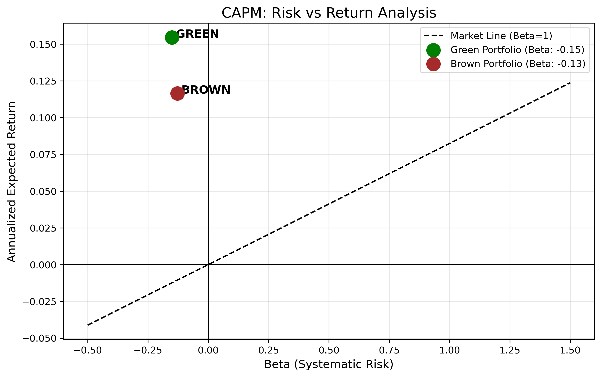
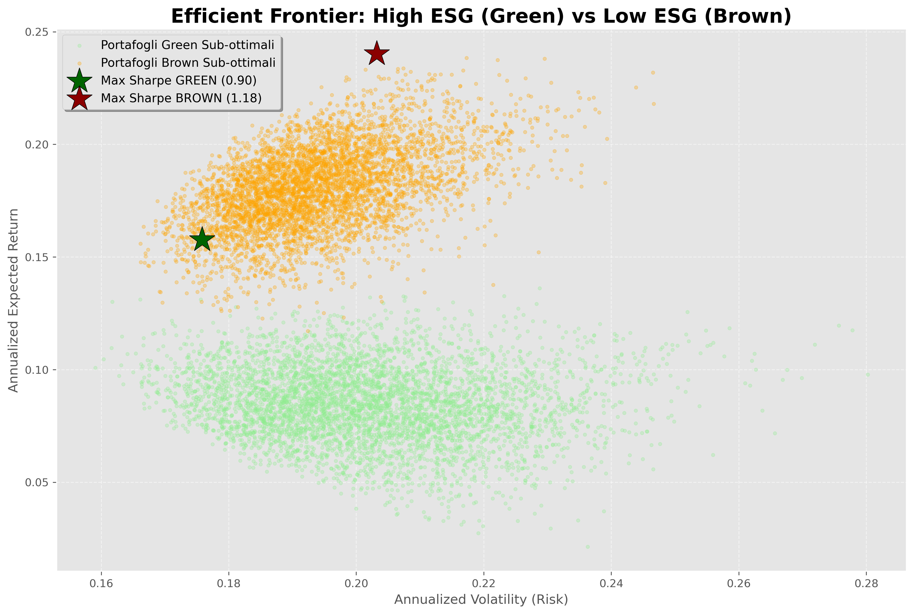

# The ESG Efficiency Gap: Quantifying the Divergence Between Regulatory Pressure and Financial Performance in the Eurozone

**Author:** Carlo Lorenzo Colombo - MSc in Banking and Finance, Università Cattolica del Sacro Cuore.

## Research Thesis & Executive Summary
Despite the aggressive expansion of the Eurozone's sustainable finance framework (SFDR, CSRD), there is a persistent **Efficiency Gap** between regulatory-driven capital allocation and actual market performance. 

This research project demonstrates that **non-ESG (Brown) assets still dominate the Efficient Frontier**, providing essential risk-premia and diversification benefits that sustainable portfolios currently fail to replicate. Through a quantitative lens, this study addresses the tension between fiduciary duties (risk-adjusted returns) and ESG policy alignment, highlighting potential **financial greenwashing** in commercial ESG narratives.

## Methodology & Tech Stack
The entire analytical pipeline was developed in **Python**:
* **Pandas & NumPy:** Data wrangling and log-return calculations.
* **yfinance:** Financial data ingestion (Adjusted Close) for Eurozone Large-Caps.
* **Statsmodels (OLS):** CAPM implementation to estimate Alpha and Beta relative to the STOXX Europe 600.
* **SciPy (Optimize):** Mean-Variance optimization using the SLSQP algorithm.
* **Matplotlib:** Efficient Frontier visualization and 5,000-iteration Monte Carlo simulations.

## Empirical Findings: Why "Brown" Still Leads
The empirical results reveal a significant outperformance of the "Brown" portfolio (Low ESG) over the "Green" portfolio (High ESG) during the analyzed 5-year window.

### Portfolio Metrics (Max Sharpe Optimization)
| Metric | Green Portfolio (High ESG) | Brown Portfolio (Low ESG) |
| :--- | :--- | :--- |
| **Annualized Volatility** | 17.58% | 20.32% |
| **Expected Annual Return** | 15.76% | 24.03% |
| **Sharpe Ratio** | **0.8963** | **1.1823** |

### Critical Analysis: The "Fiduciary Dilemma"
The findings highlight three key structural reasons for this efficiency gap:

1. **The Energy Sector Hedge:** The "Brown" portfolio benefited from a dominant allocation in the Energy sector (e.g., ENI). In the current geopolitical and inflationary environment, these assets acted as a critical hedge that ESG-compliant portfolios, by definition, lack.

2. **The Policy vs. Market Divergence:** While the EU Taxonomy pushes for green capital, market dynamics still reward carbon-intensive legacy assets through "scarcity premiums" and high dividend yields. 
3. **The Concentration Risk:** Sustainable portfolios exhibit high **Sector Bias**, relying heavily on specific Utilities (e.g., Iberdrola, 83% allocation in the Green optimized portfolio). This concentration compromises the Sharpe Ratio compared to the more diversified Brown universe.

## Repository Structure
* `01_Data_Sourcing_and_Cleaning.ipynb`: Time-series normalization and ESG proxy definition.
* `02_Risk_Return_and_CAPM.ipynb`: CAPM regression and risk-premium estimation.
* `03_Portfolio_Optimization.ipynb`: Modern Portfolio Theory implementation and Monte Carlo comparison of Efficient Frontiers.

## Conclusion
This project concludes that until carbon prices or technological shifts internalize all environmental externalities, **mathematically "efficient" portfolios will continue to lean on non-ESG assets.** Claiming that ESG integration is a "free lunch" for Alpha ignores the Tracking Error and diversification costs inherent in the current European market structure.